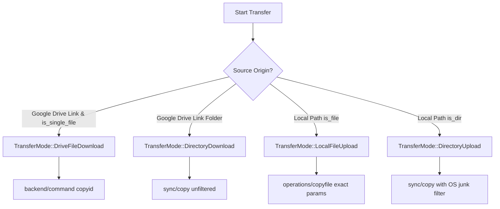
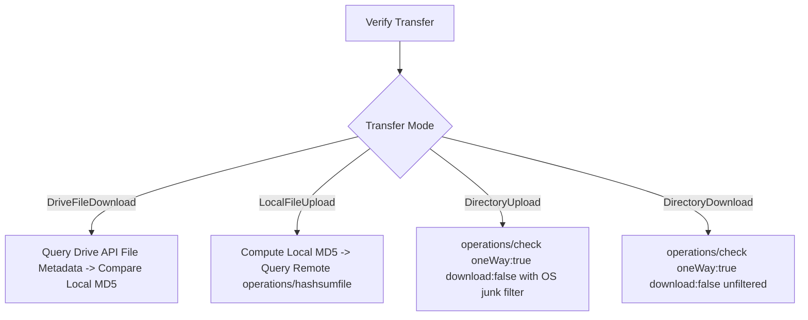

# Balladi Drive — Technical Architecture & Audit Specification

**Document Version:** 1.1.0  
**Target Application:** Balladi Drive (Desktop Media Transfer Engine)  
**Framework Stack:** Tauri v2 (Rust Backend + React/TypeScript Frontend)  
**Embedded Engine:** Rclone Core Engine v1.75.0  

## 1. Executive Summary & Purpose

Balladi Drive is a high-reliability desktop application engineered for media production workflows (video production houses, camera operators, editors, and DITs). It manages multi-hundred-gigabyte file transfers between Google Drive and local storage (NVMe drives, camera cards, and RAID storage) with strict metadata integrity, resumable chunk streaming, and durable history recording.

Completed transfer history is persisted locally. Active transfer-session state is not currently recovered automatically after an application or system crash; restarting the transfer relies on rclone skipping objects already completed at the destination.

---

## 2. Transfer Routing Architecture (`select_transfer_route`)

The transfer engine dynamically routes requests into four distinct modes based on origin, target, and filesystem parameters:

### 2.1 Mode Specifications

1. **`TransferMode::DriveFileDownload`**:
   * Evaluated via `is_google_drive_fs(src)` (checking both `gdrive:` and `gdrive,root_folder_id=`).
   * Executed using rclone's `backend/command` `copyid` with four-way multi-thread downloading (`--buffer-size 16M`, `--multi-thread-streams 4`, `--multi-thread-cutoff 50M`). `--drive-chunk-size 128M` is upload-only.
   * Destination directory creation failures are propagated immediately before starting the job.

2. **`TransferMode::LocalFileUpload`**:
   * Executed using rclone's `operations/copyfile` API with exact `srcFs`, `srcRemote`, `dstFs`, and `dstRemote` parameters.
   * **Glob-Free Safety**: Eliminates glob and regex character parsing bugs for media filenames containing special characters (`[`, `]`, `*`, `?`, `{`, `}`, `\`).

3. **`TransferMode::DirectoryUpload`**:
   * Executed using `sync/copy` with `CreateEmptySrcDirs: true` to preserve camera card directory hierarchies (`RDC/`, `THUMB/`, `CLIPS/`) and 0-byte metadata files.
   * **OS Metadata Cleansing**: Excludes Mac and Windows junk files (`.DS_Store`, `._*`, `.Trash*`, `Thumbs.db`, `desktop.ini`).

4. **`TransferMode::DirectoryDownload`**:
   * Executed using `sync/copy` with `CreateEmptySrcDirs: true` without client exclusions to preserve all remote files present on Google Drive.

---

## 3. Verification & Integrity Subsystem

Integrity verification guarantees 100% bit-for-bit accuracy against Google Drive metadata:

### 3.1 Verification Features & Safeguards
* **1 MiB Streaming Buffer**: Local MD5 calculation streams files through a 1 MiB chunk buffer via `tokio::task::spawn_blocking`, avoiding IPC blocking and memory thrash on 100GB+ camera masters.
* **Direct Remote Hash Query**: Single-file upload verification queries `operations/hashsumfile` for the exact remote MD5 and compares it to the local file MD5 without re-downloading bytes.
* **Filter Alignment on Verification**: Directory upload verification applies the identical `OS_JUNK_EXCLUDES` filter during `operations/check`, ensuring intentionally excluded temporary OS files are not falsely reported as missing.
* **Symlink & Traversal Protections**: Rejects symlink targets, sanitizes `..` parent directory traversal attempts, and parses rclone-encoded character sequences.

---

## 4. Real-Time Telemetry & Progress Accounting

### 4.1 Cumulative Session Baseline
* Progress counters track cumulative transferred bytes and file completions across multiple sequential rclone copy jobs.
* When pausing or cancelling, uncommitted active transferring bytes (`inFlightBytes`) are subtracted before setting the durable baseline, preventing overcounting or metrics exceeding total file sizes.

---

## 5. Security & System Reliability Controls

| Component | Implementation Detail | Security & Reliability Guarantee |
| :--- | :--- | :--- |
| **Engine Startup** | Exact `core/version` query | Fails closed on engine startup if rclone daemon fails version handshake. |
| **Process Termination** | 2-Second Bounded Polling | `stop_job` and `stop_all_transfers` poll with 20 iterations (100ms interval) before completing cancellation. |
| **Webhook SSRF Protection** | Protocol & Hostname Allowlist | Enforces HTTPS and rejects private IP ranges (`127.0.0.1`, `10.x`, `192.168.x`, `169.254.x`, loopbacks). |
| **Bandwidth Controls** | Dynamic `core/bwlimit` | Live throttling presets: `Unlimited`, `300M`, `100M`, `50M`, `20M`. |
| **OS File Explorer** | Asynchronous `reveal_in_finder` | Spawned via `spawn_blocking` without blocking the main event loop. |

---

## 6. Automated Verification Suite

The production gate runs 40 Rust unit/async tests, 10 frontend unit tests, a TypeScript/Vite production build, and strict Rust Clippy checks. The foundational transfer acceptance cases include:

1. `parsed_single_file_connection_routes_to_copyid`: Validates single-file Google Drive links route to `DriveFileDownload`.
2. `select_transfer_route_matrix`: Validates the complete routing matrix for all combinations of links, file paths, directories, and flags.
3. `directory_routing_and_filter_directionality`: Validates filter attachment on `DirectoryUpload` and absence on `DirectoryDownload`.
4. `destination_creation_failure_propagates_error`: Verifies early failure propagation when destination directories cannot be created.
5. `special_character_upload_uses_exact_copyfile_parameters`: Verifies `operations/copyfile` payload construction for filenames with special characters (`clip[1].mov`, `shot?.mp4`, `take*.wav`, `{final}.jpg`, `back\slash.txt`).
6. `exclusion_rules_include_windows_and_mac_junk`: Verifies `Thumbs.db`, `desktop.ini`, `.DS_Store`, `._*`, and `.Trash*` exclusions.
7. `mock_rc_upload_telemetry_and_status_cycle`: Integration test with mock RC server testing async `copyfile`, multi-sample `core/stats`, and `job/status` lifecycle.
8. `legacy_directory_mode_deserializes_cleanly`: Tests backward compatibility deserialization of legacy `"directory"` strings.
9. `legacy_directory_upload_uses_upload_direction`: Verifies `normalize_verification_route` routes legacy directory modes by local vs remote source location.
10. `pause_resume_accounting_never_exceeds_total`: Validates that deducting in-flight bytes on pause prevents totals from exceeding source sizes.
11. `single_file_verification_accepts_matching_size_and_md5`: Validates positive MD5 hash verification.
12. `single_file_verification_rejects_md5_mismatch`: Confirms corruption detection.
13. `single_file_verification_rejects_unrelated_nonempty_file`: Prevents false matching on filename collisions.
14. `single_file_verification_does_not_claim_md5_when_remote_md5_is_missing`: Guards against unverified MD5 passes.
15. `md5_verification_does_not_block_the_async_executor`: Verifies MD5 calculation runs concurrently with Tokio timers without starvation.
16. `verification_rejects_symlink_candidate`: Prevents symlink traversal vulnerabilities.
17. `verification_never_traverses_parent_directory_for_dotdot_name`: Protects against directory traversal.
18. `verification_accepts_rclone_encoded_slash_filename`: Validates forward slash character mappings.
19. `verification_accepts_rclone_encoded_windows_filename`: Validates Windows reserved character mappings.
20. `test_parse_folder_links`: Tests folder URL regex parsing.
21. `test_parse_single_file_links`: Tests single-file URL regex parsing.
22. `test_parse_invalid_links`: Tests invalid URL rejection.
23. `test_resource_key_link_parsing`: Tests resource key extraction from URLs.
24. `test_webhook_allowlist_valid`: Validates permitted webhook endpoints.
25. `test_webhook_allowlist_rejects_ssrf_and_http`: Enforces SSRF and HTTP protocol rejection.
26. `test_parse_job_ids_ignores_finished`: Ensures finished job cleanup from status maps.
